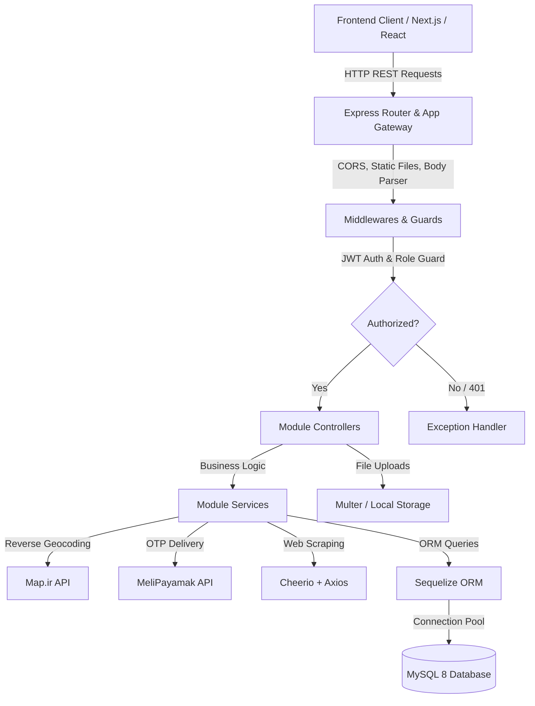
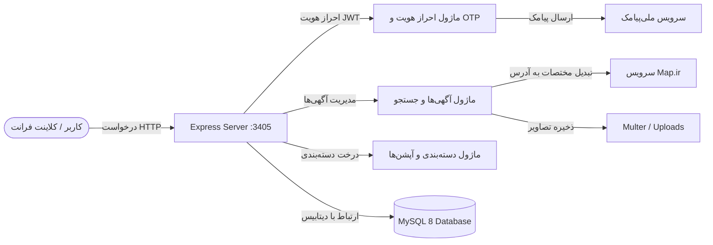

# 🚀 Sheypoor Platform Backend API

> **High-Performance RESTful Backend Service for the Sheypoor Classifieds Platform**  
> Built with **Node.js**, **Express.js**, **MySQL 8**, and **Sequelize ORM**.

[](https://nodejs.org/)
[](https://expressjs.com/)
[](https://www.mysql.com/)
[](https://sequelize.org/)
[](http://localhost:3405/swagger)
[](https://www.docker.com/)

---

## 🌐 Companion Frontend Repository
This backend powers the official frontend application available at:
👉 **[SheypoorClone Frontend Client on GitHub](https://github.com/ashkanjaycob/SheypoorClone)**

---

## 📑 Language Navigation / ناوبری زبان / Sprachauswahl

- 🇬🇧 [English Documentation](#-english-documentation)
- 🇮🇷 [مستندات فارسی](#-مستندات-فارسی-راهنمای-کامل-پروژه)
- 🇩🇪 [Deutsche Dokumentation](#-deutsche-dokumentation)

---

# 🇬🇧 English Documentation

## 📌 1. Project Overview & How It Works

The **Sheypoor Platform Backend** is a scalable, production-ready RESTful API engineered to support a full-featured classified advertisements marketplace (similar to Sheypoor, Divar, OLX, or Craigslist). 

It delivers an end-to-end ecosystem covering:
1. **Passwordless OTP-based Authentication** via Iranian mobile numbers with automatic JWT access and refresh token rotation.
2. **Infinite Multi-level Category Tree** powered by a SQL Closure/Ancestor table for lightning-fast recursive subcategory queries.
3. **Dynamic Custom Form Fields (Options)** per category (e.g., *Mileage* and *Color* for vehicles, *Area* and *Rooms* for real estate).
4. **Ad Creation & Multi-Media Uploads** with automatic geospatial reverse geocoding via Map.ir API to resolve coordinates to province, city, and neighborhood.
5. **Fast Filtering & Full-Text Search** across titles, descriptions, and category hierarchies.
6. **Live Web Scraper Engine** to crawl and import real ads from Sheypoor.
7. **Role-Based Access Control (RBAC)** distinguishing regular users from platform administrators.



---

## 🏗️ 2. Architecture & Design Patterns

The codebase is designed following modern **Layered Modular Architecture** principles to achieve separation of concerns, high maintainability, and clean testability:

```
src/
├── app.routes.js               # Central routing entry point aggregating all module routers
├── config/                     # Configuration layer
│   ├── database.config.js      # Sequelize connection pool, SSL setup, and dialect options
│   └── swagger.config.js       # OpenAPI 3.0 JSDoc configuration & Swagger UI setup
├── models/                     # Relational definitions & database sync orchestrator
│   └── index.js                # Foreign keys, 1:N, N:M closure table associations
├── common/                     # Cross-cutting concerns & shared utilities
│   ├── constant/               # Immutable enums (RoleEnum, EnvEnum, CookieEnum)
│   ├── exception/              # Global 404 & centralized error handling middleware
│   ├── guard/                  # Authorization (JWT) & Admin guards
│   ├── messages/               # Centralized localized system response messages
│   └── utils/                  # Multer disk storage, HTTP clients (Map.ir), validators
└── modules/                    # Domain-Driven Feature Modules
    ├── auth/                   # OTP generation, SMS sending, token issuance & refresh
    ├── user/                   # User profile management (whoami)
    ├── category/               # Hierarchical category tree & ancestor closure model
    ├── option/                 # Dynamic category-specific custom attributes
    └── post/                   # Ad listing, search, creation, editing, deletion & scraper
```

### Key Architectural Highlights:
- **Controller-Service-Model Pattern**: Controllers handle HTTP requests, input sanitization, and responses; Services encapsulate pure domain business logic; Models define database schema and associations.
- **Closure Table Pattern for Tree Hierarchies**: In addition to `parentId`, a `CategoryAncestorModel` table stores all ancestor-descendant pairs. This enables `O(1)` query complexity when filtering posts in a parent category (e.g. searching "Vehicles" immediately retrieves ads in "Cars", "Motorcycles", etc., without recursive CTE overhead).
- **Dynamic EAV-like Option Engine**: Dynamic fields per category allow flexible schema extension without altering relational table schemas.
- **Centralized Exception Handling**: All errors thrown in async handlers are caught and formatted uniformly via `AllExceptionHandler`.

---

## 💻 3. Technology Stack & Dependencies

| Category | Technology / Package | Description & Role |
|---|---|---|
| **Runtime** | `Node.js >= 20` | High-performance asynchronous JavaScript runtime |
| **Framework** | `Express.js 4.18` | Minimalist and flexible web application framework |
| **Database** | `MySQL 8.0` | Relational database with InnoDB engine and UTF8MB4 encoding |
| **ORM** | `Sequelize 6.37` | Promise-based Node.js ORM with connection pooling |
| **Authentication** | `jsonwebtoken 9.0` | JWT Access Token (short-lived) & Refresh Token (long-lived) |
| **File Uploads** | `Multer 1.4` | Multipart/form-data handler for multi-image uploads |
| **Documentation** | `swagger-jsdoc 6.2` & `swagger-ui-express 5.0` | OpenAPI 3.0 interactive Swagger documentation |
| **Geocoding** | `Map.ir API` | Reverse geocoding for coordinates to address resolution |
| **SMS Gateway** | `MeliPayamak API` & Console Fallback | OTP SMS delivery service with dev mode bypass |
| **Web Scraping** | `Cheerio 1.0` & `Axios 1.8` | HTML parsing and automated crawler engine |
| **Security & Utilities**| `cors`, `cookie-parser`, `auto-bind`, `slugify` | Security headers, cookie parsing, class autobinding |
| **Containerization** | `Docker` & `Docker Compose` | Isolated multi-container deployment (App + MySQL + Adminer) |

---

## ✨ 4. Features & Capabilities

1. **Authentication & Authorization**:
   - Mobile OTP passwordless login.
   - Dual-token lifecycle (`accessToken` + `refreshToken`).
   - Debug mode (`OTP_DEBUG_RETURN=true`) for instant frontend testing without SMS gateway credits.
   - Admin authorization guard to protect management endpoints.
2. **Category Hierarchy**:
   - Unlimited nesting depth.
   - Ancestor closure links for recursive filtering.
   - Category slugs and icons support.
3. **Dynamic Category Attributes**:
   - Field types: `string`, `number`, `boolean`, `array` (select dropdown).
   - Validation constraints (required, enum allowed values).
4. **Classified Ads Lifecycle**:
   - Ad creation with up to 10 image uploads (max 3MB each).
   - Reverse geocoding of `lat` and `lng` to province, city, district, and street address.
   - Paginated feed with category and text search filters.
   - Backward-compatible legacy endpoints.
   - Edit, view author phone number, and ad deletion.
5. **Live Sheypoor Scraper**:
   - Crawl listings from external Sheypoor URLs with images and descriptions.

---

## 📡 5. API Endpoints Reference

Interactive Swagger documentation is available at: **`http://localhost:3405/swagger`**

| Method | Endpoint | Auth | Description |
|---|---|:---:|---|
| **GET** | `/health` | ❌ | Service health check |
| **GET** | `/` | ❌ | Root ads feed (legacy non-paginated) |
| **GET** | `/post` | ❌ | Paginated ads list (`?page=&limit=&category=&search=`) |
| **GET** | `/post/:id` | ❌ | Ad details with seller contact phone |
| **POST** | `/auth/send-otp` | ❌ | Request OTP verification code |
| **POST** | `/auth/check-otp` | ❌ | Verify OTP and obtain JWT tokens |
| **POST** | `/auth/check-refresh-token` | ❌ | Renew JWT access & refresh tokens |
| **GET** | `/auth/logout` | 🔒 | Invalidate tokens and logout |
| **GET** | `/user/whoami` | 🔒 | Get authenticated user profile |
| **GET** | `/category` | ❌ | Get full category tree hierarchy |
| **POST** | `/category` | 👑 Admin | Create a new category |
| **DELETE**| `/category/:id` | 👑 Admin | Delete category and all descendants |
| **GET** | `/option` | ❌ | Get all category dynamic options |
| **GET** | `/option/:id` | ❌ | Get option by ID |
| **GET** | `/option/by-category/:categoryId` | ❌ | Get options by Category ID |
| **GET** | `/option/by-category-slug/:slug` | ❌ | Get options by Category Slug |
| **POST** | `/option` | 👑 Admin | Create dynamic option field |
| **PUT** | `/option/:id` | 👑 Admin | Update option field definition |
| **DELETE**| `/option/:id` | 👑 Admin | Delete option field |
| **GET** | `/post/create` | 🔒 | Get category form wizard options (`?slug=`) |
| **POST** | `/post/create` | 🔒 | Publish new ad (multipart form + images) |
| **PUT** | `/post/update/:id` | 🔒 | Update owned ad |
| **GET** | `/post/my` | 🔒 | Get logged-in user's ads |
| **DELETE**| `/post/delete/:id` | 🔒 | Delete owned ad |
| **POST** | `/post/scrape` | 🔒 | Scrape ads from Sheypoor URL |

---

## 🚀 6. Installation & Quick Start

### Prerequisites
- **Node.js** >= 20.0
- **Docker** & **Docker Compose** (recommended for database)

### Step-by-Step Setup

```bash
# 1. Clone the repository
git clone https://github.com/ashkanjaycob/sheypoorBackend.git
cd sheypoorBackend

# 2. Install dependencies
npm install

# 3. Configure environment variables
cp .env.example .env

# 4. Start MySQL & Adminer database containers
docker compose up -d

# 5. Seed sample categories & options (Optional)
npm run db:seed

# 6. Create an admin user (Optional)
npm run db:admin -- 09121112233 "Admin User"

# 7. Start development server
npm run dev
```

The server will start at **`http://localhost:3405`**  
Access Swagger Documentation at **`http://localhost:3405/swagger`**  
Access Adminer DB GUI at **`http://localhost:8080`**

---

## ⚙️ 7. Environment Variables Reference

| Variable | Default | Description |
|---|---|---|
| `PORT` | `3405` | HTTP server listening port |
| `NODE_ENV` | `development` | Application environment (`development` / `production`) |
| `MYSQL_HOST` | `127.0.0.1` | MySQL server host |
| `MYSQL_PORT` | `3306` | MySQL server port |
| `MYSQL_USER` | `sheypoor` | Database username |
| `MYSQL_PASSWORD` | `sheypoor` | Database password |
| `MYSQL_DATABASE` | `sheypoor` | Database name |
| `DATABASE_URL` | - | Production MySQL connection URI (overrides `MYSQL_*`) |
| `DB_SSL` | `false` | Enable SSL for remote database connections |
| `JWT_SECRET_KEY` | - | Secret key for signing JWT tokens |
| `COOKIE_SECRET_KEY` | - | Secret key for cookie encryption |
| `MAP_IR_URL` | `https://map.ir/reverse` | Map.ir reverse geocoding API URL |
| `MAP_API_KEY` | - | Map.ir API access key |
| `MELI_TOKEN` | - | MeliPayamak SMS token (leave empty for console debug mode) |
| `OTP_DEBUG_RETURN` | `true` | Return OTP code in `/auth/send-otp` response for easy frontend testing |

---

# 🇮🇷 مستندات فارسی (راهنمای کامل پروژه)

## 📌 ۱. معرفی و نحوه کارکرد پروژه

پروژه **بک‌اند شیپور (Sheypoor Platform Backend)** یک وب‌سرویس RESTful پیشرفته، مقیاس‌پذیر و آماده پروداکشن است که برای مدیریت کامل یک پلتفرم ثبت آگهی‌های نیازمندی و خرید و فروش آنلاین (مشابه شیپور، دیوار و ...) طراحی و پیاده‌سازی شده است.

این سامانه به عنوان هسته مرکزی پردازش داده، احراز هویت و مدیریت نیازمندی‌ها عمل کرده و هماهنگی کاملی با کلاینت فرانت‌اند دارد:
👉 **[مشاهده ریپازیتوری فرانت‌اند در گیت‌هاب (SheypoorClone)](https://github.com/ashkanjaycob/SheypoorClone)**



---

## 🏗️ ۲. معماری نرم‌افزار و الگوهای طراحی

این پروژه با پیروی از اصول **معماری لایه‌ای ماژولار (Layered Modular Architecture)** پیاده‌سازی شده است:

```
src/
├── app.routes.js               # روتر اصلی تجمیع‌کننده تمامی ماژول‌ها
├── config/                     # تنظیمات اتصال به دیتابیس و مستندات سواگر
├── models/                     # مدل‌های رابطه ای Sequelize و تعریف روابط کلید خارجی
├── common/                     # توابع عمومی، میدلورها، گاردها و هندلر خطاها
│   ├── constant/               # ثابت‌ها و اینام‌های سیستم (نقش‌ها، کوکی، محیط)
│   ├── exception/              # میدلورهای مدیریت خطای سراسری (404 و خطاهای سرور)
│   ├── guard/                  # گاردهای احراز هویت JWT و دسترسی ادمین
│   ├── messages/               # پیام‌های استاندارد و یکپارچه سیستم
│   └── utils/                  # ابزارهای کاربردی (Multer، ارتباط با Map.ir و اعتبارسنجی)
└── modules/                    # ماژول‌های مستقل دامنه
    ├── auth/                   # ورود بدون رمز با OTP، تولید و تمدید JWT
    ├── user/                   # اطلاعات پروفایل کاربر لاگین‌شده
    ├── category/               # درخت سلسله‌مراتبی دسته‌ها و جدول ارتقایافته اجداد
    ├── option/                 # ویژگی‌ها و فیلدهای داینامیک هر دسته
    └── post/                   # ایجاد، ویرایش، حذف، جستجو و اسکرپر آگهی‌ها
```

### ویژگی‌های فنی معماری:
1. **الگوی جداسازی وظایف (Controller-Service-Model)**: کنترلرها مسئول مدیریت ریکوئست/ریسپانس، سرویس‌ها عهده‌دار منطق بیزنس و مدل‌ها مسئول تراکنش‌های دیتابیس هستند.
2. **جدول اجداد (Ancestor Closure Table)**: برای جلوگیری از کوئری‌های بازگشتی سنگین SQL، ارتباطات سلسله‌مراتبی والدین و فرزندان در جدول واسط `CategoryAncestorModel` ذخیره می‌شود تا هنگام فیلتر کردن یک دسته والد، تمامی آگهی‌های زیردسته‌ها با سرعت $O(1)$ بازیابی شوند.
3. **سیستم فیلدهای پویا (Dynamic EAV-like Options)**: هر دسته می‌تواند فیلدهای اختصاصی خود را داشته باشد (مانند کارکرد برای خودرو، متراژ برای املاک).

---

## 💻 ۳. استک تکنولوژی‌ها و وابستگی‌ها

| بخش | فناوری / پکیج | نقش در پروژه |
|---|---|---|
| **محیط اجرا** | `Node.js >= 20` | رانتایم ناهمگام و قدرتمند جاوااسکریپت |
| **فریم‌ورک وب** | `Express.js 4.18` | فریم‌ورک سبک و انعطاف‌پذیر وب |
| **پایگاه داده** | `MySQL 8.0` | دیتابیس رابطه‌ای با انجین InnoDB و کاراکترست utf8mb4 |
| **ORM** | `Sequelize 6.37` | نگاشت شی‌ء-رابطه‌ای پیشرفته به همراه Connection Pooling |
| **امنیت و احراز هویت** | `jsonwebtoken 9.0` | مدیریت توکن‌های دسترسی کوتاه مدت و توکن‌های تجدید |
| **آپلود فایل** | `Multer 1.4` | مدیریت آپلود تصاویر با فیلتر پسوند و محدودیت حجم |
| **مستندسازی** | `Swagger (OpenAPI 3.0)` | رابط گرافیکی تست و داکیومنت کامل اندپوینت‌ها |
| **سرویس نقشه** | `Map.ir API` | ژئوکدینگ معکوس جهت استخراج نام استان، شهر و محله از روی نقشه |
| **سرویس پیامک** | `MeliPayamak API` | ارسال کد تایید با امکان چاپ در کنسول در حالت دولوپمنت |
| **خزشگر وب** | `Cheerio` & `Axios` | استخراج خودکار آگهی‌ها از سایت شیپور جهت پر کردن داده اولیه |
| **کانتینرسازی** | `Docker & Compose` | اجرای ایزوله دیتابیس و برنامه در محیط محلی و سرور |

---

## ✨ ۴. قابلیت‌ها و امکانات پروژه

- 🔑 **احراز هویت مدرن بدون پسورد (OTP)**: ورود سریع با شماره موبایل و دریافت توکن‌های Access و Refresh.
- 🧪 **حالت توسعه آسان (Debug OTP)**: امکان بازگرداندن کد تایید در پاسخ API جهت تست بدون نیاز به پنل پیامکی فعال.
- 🌳 **درخت دسته‌بندی با عمق نامحدود**: امکان ایجاد دسته‌های تودرتو با آیکون و اسلاگ مجزا.
- 📝 **فرم‌های ثبت آگهی داینامیک**: بارگذاری خودکار فیلدهای اختصاصی بر اساس دسته‌بندی انتخاب‌شده.
- 🗺️ **مسیریابی و آدرس‌دهی خودکار**: تبدیل خودکار طول و عرض جغرافیایی به آدرس پستی متنی از طریق سرویس Map.ir.
- 🔍 **جستجوی پیشرفته و صفحه‌بندی**: فیلتر بر اساس کلمات کلیدی در عنوان/متن و دسته‌بندی‌ها به صورت بازگشتی.
- 🤖 **اسکرپر مستقیم شیپور**: دریافت لینک دسته‌بندی از شیپور و درون‌ریزی اتوماتیک آگهی‌ها همراه با تصاویر و قیمت.
- 🛡️ **کنترل سطح دسترسی ادمین (RBAC)**: محافظت از اندپوینت‌های مدیریتی نظیر ساخت و حذف دسته‌ها و آپشن‌ها.

---

## 📡 ۵. جدول اندپوینت‌های API

مستندات تعاملی کامل در آدرس: **`http://localhost:3405/swagger`**

| متد | مسیر (Endpoint) | دسترسی | توضیح |
|---|---|:---:|---|
| **GET** | `/health` | عمومی | بررسی وضعیت سلامت سرور |
| **GET** | `/` | عمومی | لیست آگهی‌ها روی روت اصلی (سازگاری با نسخه قبل) |
| **GET** | `/post` | عمومی | لیست آگهی‌های عمومی صفحه‌بندی شده با فیلتر دسته و جستجو |
| **GET** | `/post/:id` | عمومی | جزئیات کامل آگهی همراه با شماره تماس آگهی‌دهنده |
| **POST** | `/auth/send-otp` | عمومی | درخواست ارسال کد تایید یکبار مصرف |
| **POST** | `/auth/check-otp` | عمومی | تایید کد OTP و دریافت توکن ورود |
| **POST** | `/auth/check-refresh-token` | عمومی | دریافت توکن جدید با استفاده از Refresh Token |
| **GET** | `/auth/logout` | 🔒 کاربر | خروج از حساب کاربری و پاک کردن سشن |
| **GET** | `/user/whoami` | 🔒 کاربر | دریافت اطلاعات پروفایل کاربر احراز هویت شده |
| **GET** | `/category` | عمومی | دریافت کل ساختار درختی دسته‌بندی‌ها |
| **POST** | `/category` | 👑 ادمین | ایجاد دسته‌بندی جدید |
| **DELETE**| `/category/:id` | 👑 ادمین | حذف دسته‌بندی و زیرمجموعه‌ها |
| **GET** | `/option` | عمومی | دریافت لیست تمامی فیلدهای داینامیک |
| **GET** | `/option/:id` | عمومی | دریافت اطلاعات یک آپشن با شناسه |
| **GET** | `/option/by-category/:categoryId` | عمومی | دریافت آپشن‌های یک دسته با شناسه |
| **GET** | `/option/by-category-slug/:slug` | عمومی | دریافت آپشن‌های یک دسته با اسلاگ |
| **POST** | `/option` | 👑 ادمین | ایجاد فیلد داینامیک جدید برای یک دسته |
| **PUT** | `/option/:id` | 👑 ادمین | ویرایش مشخصات فیلد داینامیک |
| **DELETE**| `/option/:id` | 👑 ادمین | حذف فیلد داینامیک |
| **GET** | `/post/create` | 🔒 کاربر | دریافت فرم دسته‌ها و آپشن‌ها برای ثبت آگهی |
| **POST** | `/post/create` | 🔒 کاربر | ثبت آگهی جدید به همراه آپلود چند عکس و موقعیت مکانی |
| **PUT** | `/post/update/:id` | 🔒 کاربر | ویرایش آگهی متعلق به کاربر |
| **GET** | `/post/my` | 🔒 کاربر | مشاهده آگهی‌های ثبت‌شده توسط کاربر لاگین‌شده |
| **DELETE**| `/post/delete/:id` | 🔒 کاربر | حذف آگهی کاربر |
| **POST** | `/post/scrape` | 🔒 کاربر | اسکرپ و استخراج خودکار آگهی‌ها از شیپور |

---

## 🚀 ۶. راهنمای نصب و راه‌اندازی سریع

### پیش‌نیازها
- نصب **Node.js** (نسخه ۲۰ یا بالاتر)
- نصب **Docker Desktop** (جهت بالا آوردن سریع دیتابیس MySQL)

### مراحل اجرا:

```bash
# ۱. کلون کردن ریپازیتوری
git clone https://github.com/ashkanjaycob/sheypoorBackend.git
cd sheypoorBackend

# ۲. نصب پکیج‌ها
npm install

# ۳. تنظیم متغیرهای محیطی
cp .env.example .env

# ۴. بالا آوردن دیتابیس MySQL و Adminer با داکر
docker compose up -d

# ۵. درج داده‌های نمونه (اختیاری)
npm run db:seed

# ۶. ساخت کاربر ادمین (اختیاری)
npm run db:admin -- 09121112233 "کاربر ادمین"

# ۷. اجرای سرور در حالت توسعه
npm run dev
```

سرور روی پورت **`http://localhost:3405`** راه‌اندازی خواهد شد.  
مستندات سواگر: **`http://localhost:3405/swagger`**  
مدیریت گرافیکی دیتابیس (Adminer): **`http://localhost:8080`**

---

# 🇩🇪 Deutsche Dokumentation

## 📌 1. Projektübersicht & Funktionsweise

Das **Sheypoor Platform Backend** ist eine robuste, modulare und produktionsbereite RESTful-API, die für Kleinanzeigenportale (vergleichbar mit eBay Kleinanzeigen, Craigslist oder OLX) entwickelt wurde. 

Dieses Backend dient als zentrale Datenschicht und Schnittstelle für die Frontend-Webanwendung:
👉 **[Frontend-Client auf GitHub (SheypoorClone)](https://github.com/ashkanjaycob/SheypoorClone)**

### Zentrale Systemkomponenten:
1. **Passwortlose OTP-Authentifizierung**: Anmeldung via Mobilfunknummer und Verifizierungscode mit JWT Access- und Refresh-Token-Lebenszyklus.
2. **Mehrstufige Kategoriestruktur mit Closure Table**: Performante, unbegrenzt verschachtelbare Kategorienhierarchie für $O(1)$-Abfragen von Haupt- und Unterkategorien.
3. **Dynamisches Kategorienspezifisches Attributsystem (Options)**: Flexible Erfassung von Zusatzfeldern (z. B. Kilometerstand bei Fahrzeugen, Quadratmeter bei Immobilien).
4. **Kleinanzeigen-Verwaltung & Medienverarbeitung**: Upload von bis zu 10 Bildern pro Anzeige mit automatischer Geokodierung (Breiten-/Längengrad zu Provinz, Stadt, Stadtteil via Map.ir).
5. **Volltextsuche & Filter**: Suchfunktion über Titel, Beschreibungen und Kategoriebäume.
6. **Integrierter Web-Scraper**: Automatisierter Crawler zum Importieren realer Anzeigen aus externen Webseiten.
7. **Rollenbasiertes Berechtigungssystem (RBAC)**: Trennung von normalen Nutzern und Administratoren.

---

## 🏗️ 2. Architektur & Entwurfsmuster

Die Anwendung folgt einer sauberen **Schichtenarchitektur (Layered Modular Architecture)**:

```
src/
├── app.routes.js               # Zentraler Routing-Einstiegspunkt
├── config/                     # Datenbankverbindung & Swagger-Konfiguration
├── models/                     # Sequelize-Modelle & relationale Verknüpfungen
├── common/                     # Shared Utilities, Middleware, Enums & Guards
└── modules/                    # Fachliche Domänenmodule (auth, category, option, post, user)
```

- **Controller-Service-Model Entwurfsmuster**: Strikte Trennung von HTTP-Verarbeitung, Geschäftslogik und Datenbankschicht.
- **Closure Table Pattern**: `CategoryAncestorModel` speichert alle Vorfahren-Nachkommen-Relationen, wodurch rekursive SQL-Abfragen vermieden werden.
- **Zentralisierte Ausnahmebehandlung**: Einheitliche Fehlerformate über `AllExceptionHandler`.

---

## 💻 3. Technologie-Stack

| Bereich | Technologie / Paket | Beschreibung |
|---|---|---|
| **Laufzeitumgebung** | `Node.js >= 20` | Schnelle asynchrone V8-JavaScript-Engine |
| **Webframework** | `Express.js 4.18` | Schlankes und performantes HTTP-Framework |
| **Datenbank** | `MySQL 8.0` | Relationale Datenbank mit InnoDB & UTF8MB4-Zeichensatz |
| **ORM** | `Sequelize 6.37` | Node.js ORM mit Connection Pooling und Migration Sync |
| **Authentifizierung** | `jsonwebtoken 9.0` | JWT Access- & Refresh-Token-Autorisierung |
| **Datei-Uploads** | `Multer 1.4` | Sichere Multipart-Verarbeitung für Bilddateien |
| **Dokumentation** | `OpenAPI 3.0 / Swagger` | Interaktive API-Spezifikation und UI |
| **Geokodierung** | `Map.ir API` | Reverse-Geocoding von Koordinaten in Adressdaten |
| **SMS-Gateway** | `MeliPayamak API` | Zustellung von SMS-Einmalkennwörtern (mit Konsolen-Fallback) |
| **Web-Scraping** | `Cheerio` & `Axios` | HTML-Parsing und Web-Crawler für Testdaten |
| **Containerisierung** | `Docker & Docker Compose` | Standardisierte Multi-Container-Umgebung |

---

## 📡 4. API-Endpunkt-Übersicht

Die interaktive Swagger-Dokumentation ist unter **`http://localhost:3405/swagger`** erreichbar.

| Methode | Endpunkt | Auth | Beschreibung |
|---|---|:---:|---|
| **GET** | `/health` | Öffentlich | Server-Gesundheitsprüfung |
| **GET** | `/post` | Öffentlich | Paginierte Anzeigenliste mit Filter & Suche |
| **GET** | `/post/:id` | Öffentlich | Detailansicht einer Anzeige inkl. Telefonnummer |
| **POST** | `/auth/send-otp` | Öffentlich | OTP-Verifizierungscode anfordern |
| **POST** | `/auth/check-otp` | Öffentlich | OTP verifizieren und JWT-Tokens erhalten |
| **POST** | `/auth/check-refresh-token` | Öffentlich | Tokens mit Refresh-Token erneuern |
| **GET** | `/auth/logout` | 🔒 Nutzer | Abmelden und Session-Tokens ungültig machen |
| **GET** | `/user/whoami` | 🔒 Nutzer | Authentifiziertes Nutzerprofil abrufen |
| **GET** | `/category` | Öffentlich | Komplette Kategorie-Baumstruktur abrufen |
| **POST** | `/category` | 👑 Admin | Neue Kategorie anlegen |
| **DELETE**| `/category/:id` | 👑 Admin | Kategorie und Unterkategorien löschen |
| **GET** | `/option` | Öffentlich | Alle dynamischen Kategorie-Optionen abrufen |
| **POST** | `/option` | 👑 Admin | Neues dynamisches Optionsfeld definieren |
| **PUT** | `/option/:id` | 👑 Admin | Optionsfeld aktualisieren |
| **DELETE**| `/option/:id` | 👑 Admin | Optionsfeld löschen |
| **GET** | `/post/create` | 🔒 Nutzer | Formularoptionen für Anzeigenerstellung abrufen |
| **POST** | `/post/create` | 🔒 Nutzer | Neue Kleinanzeige mit Bildern & Ort veröffentlichen |
| **PUT** | `/post/update/:id` | 🔒 Nutzer | Eigene Anzeige bearbeiten |
| **GET** | `/post/my` | 🔒 Nutzer | Eigene veröffentlichte Anzeigen auflisten |
| **DELETE**| `/post/delete/:id` | 🔒 Nutzer | Eigene Anzeige löschen |
| **POST** | `/post/scrape` | 🔒 Nutzer | Anzeigen von externer URL importieren |

---

## 🚀 5. Installation & Schnellstart

```bash
# 1. Repository klonen
git clone https://github.com/ashkanjaycob/sheypoorBackend.git
cd sheypoorBackend

# 2. Abhängigkeiten installieren
npm install

# 3. Umgebungsvariablen anlegen
cp .env.example .env

# 4. MySQL- und Adminer-Container starten
docker compose up -d

# 5. Beispieldaten einspielen (optional)
npm run db:seed

# 6. Admin-Benutzer anlegen (optional)
npm run db:admin -- 09121112233 "Admin User"

# 7. Entwicklungsserver starten
npm run dev
```

Der Server läuft unter **`http://localhost:3405`**  
Swagger UI: **`http://localhost:3405/swagger`**  
Adminer DB-Verwaltung: **`http://localhost:8080`**

---

## 👨‍💻 Author & License
- **Author**: Ashkan Yaghoobi
- **Frontend App**: [SheypoorClone](https://github.com/ashkanjaycob/SheypoorClone)
- **License**: ISC
